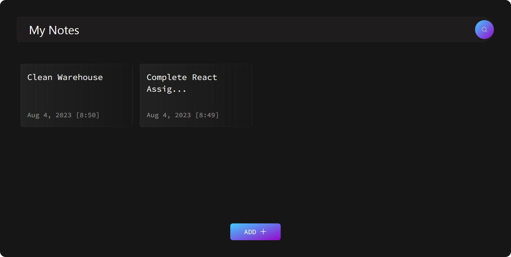

# DevOps Project Description 

This will be the base app for developinig the DevOps Final Project, as the main goal of Pengembangan Sistem dan Operasi (System Development and Operations) course. This course is a part of the Information Systems department of Institut Teknologi Sepuluh Nopember (ITS) Surabaya.

## Course Description
DevOps merupakan gabungan dari dua kata Development dan Operations dimana mata kuliah ini akan mengajarkan development/pengembangan dari sebuah sistem/aplikasi dengan operation/operasional. Devops memiliki prinsip developer untuk mengkoordinasikan antar tim yaitu tim development dengan tim operations dengan efektif dan efisien. Hal yang akan dipelajari adalah Operating System, Pengelolaan server, Cloud computing, Workflow management system, process automation, dan lain sebagainya.

## Members
We are working as Group 12 (Student ID - Name): 
* 5026221139 - Dimas Fajar Ramadhan 
* 5026221144 - Alfa Renaldo Aluska 
* 5026221156 - Muhammad Ali Husain 
* 5026221159 - Candleline Audrina Firsta 

# MyNotes - Simple and Modern Day-to-Day Tasks Notes App

Welcome to **MyNotes** 📓, your solution for effortless day-to-day task management. This intuitive notes app, created with React.js and adorned with Tailwind CSS, offers a clean, modern, and user-friendly interface to help you stay organized and productive.

  

🔗 [Visit Here](https://react-notes-app-three.vercel.app/) to experience MyNotes in action!

## Features

📝 **Create and Edit Notes:** Capture your thoughts quickly by adding new notes. Need to make changes? No worries! Edit your notes seamlessly.

🗑️ **Delete Notes:** Completed a task? Simply delete the note associated with it.

📱 **Responsive Design:** Whether you're on your desktop, tablet, or smartphone, MyNotes provides a smooth and consistent user experience.

🌈 **Modern Styling:** Enjoy a visually appealing design with carefully chosen colors, fonts, and layout.

🎨 **Custom Icons:** Intuitive icons guide you through app actions, making your interaction enjoyable.

## 🚀 Getting Started

To start using MyNotes on your local machine, follow these steps:

1. **Clone the Repository:** Clone the MyNotes repository to your local system.

2. **Install Dependencies:** Install the necessary dependencies using your preferred package manager.

3. **Launch the App:** Start the app using the appropriate command.

4. **Access the App:** Open your web browser and navigate to the provided local URL to experience MyNotes.

## 🌐 Technologies & Styling

MyNotes showcases the perfect blend of technology and style:

- **React.js:** Leverage the power of React.js for dynamic and responsive user interfaces.

- **Tailwind CSS:** Style your app effortlessly using Tailwind CSS's utility-first approach.

- **Icons:** Thoughtfully chosen icons from reputable sources enhance the visual appeal and user-friendliness.

## 🗄️ Storage

MyNotes utilizes the browser's local storage to ensure your notes persist even after closing the app.

## 📬 Source

This project was forked from Sahil Makadia's repository. 📅
