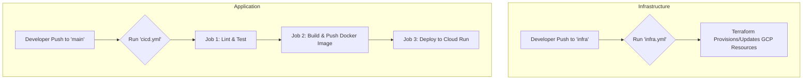
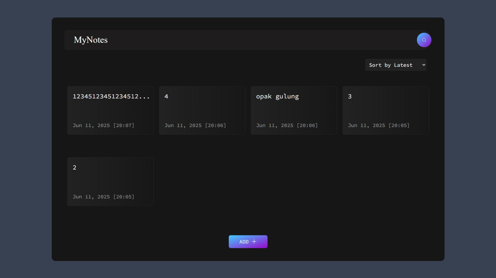

# DevOps Project Description 

This will be the base app for developinig the DevOps Final Project, as the main goal of Pengembangan Sistem dan Operasi (System Development and Operations) course. This course is a part of the Information Systems department of Institut Teknologi Sepuluh Nopember (ITS) Surabaya.

## Course Description
DevOps merupakan gabungan dari dua kata Development dan Operations dimana mata kuliah ini akan mengajarkan development/pengembangan dari sebuah sistem/aplikasi dengan operation/operasional. Devops memiliki prinsip developer untuk mengkoordinasikan antar tim yaitu tim development dengan tim operations dengan efektif dan efisien. Hal yang akan dipelajari adalah Operating System, Pengelolaan server, Cloud computing, Workflow management system, process automation, dan lain sebagainya.


## Members
We are working as Group 12 (Student ID - Name): 
* 5026221139 - Dimas Fajar Ramadhan 
* 5026221144 - Alfa Renaldo Aluska 
* 5026221156 - Muhammad Ali Husain 
* 5026221159 - Candleline Audrina Firsta 

## Schedule
You can find the project schedule here: (https://intip.in/plandevops11).

## Cloud Live Link
You can check the live link here: (https://pso-kelompok12-441660509509.asia-southeast2.run.app/).

# Documentation
The documentation of this project is here: (https://its.id/m/pso12doc).

# Flow

### 🏗️ Infrastructure as Code (IaC) dengan Terraform

Provisioning infrastruktur (seperti Google Cloud Storage Bucket) dikelola menggunakan **Terraform** dan diotomatisasi melalui GitHub Actions.

#### 📁 File Infra: `.github/workflows/infra.yml`

Workflow ini dijalankan saat:
- Ada push ke branch `infra`.
- Dijalankan secara manual dari tab Actions di GitHub (`workflow_dispatch`).

#### ⚙️ Rangkaian Proses Provisioning

1.  **Checkout Repository**: Mengunduh kode agar file konfigurasi Terraform (`main.tf`) dapat diakses.
2.  **Setup Terraform**: Menginstal dan menyiapkan Terraform CLI di runner.
3.  **Create `credentials.json`**: Membuat file kredensial Google Cloud dari secret `GCP_SA_KEY` agar Terraform dapat melakukan autentikasi.
4.  **Terraform Init**: Menginisialisasi backend dan provider Terraform.
5.  **Terraform Plan**: Membuat rencana eksekusi untuk melihat perubahan apa yang akan diterapkan pada infrastruktur.
6.  **Terraform Apply**: Menerapkan perubahan yang direncanakan secara otomatis (`-auto-approve`) untuk membuat atau memperbarui resource di Google Cloud.

---

### 🔄 CI/CD Terpadu

Proses Continuous Integration (CI) dan Continuous Delivery (CD) digabungkan menjadi satu alur kerja yang efisien, dipicu oleh perubahan pada branch `main`.

#### 📁 File CI/CD: `.github/workflows/cicd.yml`

Workflow ini berjalan secara otomatis setiap kali ada **push ke branch `main`**.

#### ⚙️ Rangkaian Proses CI/CD

Workflow ini terdiri dari tiga *jobs* yang berjalan secara berurutan:

1.  **🧪 Job 1: Lint & Test** (`setup-install-lint-and-test`)
    -   **Setup Node.js**: Menyiapkan environment Node.js versi 20.
    -   **Install Dependencies**: Menjalankan `npm install`.
    -   **Lint & Test**: Menjalankan `npm run lint` untuk analisis kode statis dan `npm test` untuk pengujian unit menggunakan Vitest.

2.  **📦 Job 2: Build & Push Image** (`build-and-push`)
    * Job ini hanya berjalan jika *job pertama berhasil*.
    -   **Login ke DockerHub**: Melakukan autentikasi menggunakan `DOCKER_USERNAME` dan `DOCKER_PASSWORD`.
    -   **Build & Push**: Membangun Docker image dengan menyertakan *build argument* `VITE_GPT_TOKEN` dari *secrets*. Image diberi *tag* unik menggunakan **short commit hash** dan diunggah ke DockerHub.

3.  **🚀 Job 3: Deploy ke Cloud Run** (`deploy`)
    * Job ini hanya berjalan jika *job kedua berhasil*.
    -   **Authenticate ke Google Cloud**: Menggunakan `GCP_SA_KEY` untuk autentikasi.
    -   **Deploy**: Melakukan deploy image yang baru saja di-*push* (dengan tag commit hash) dari DockerHub ke layanan **Google Cloud Run**. Layanan dikonfigurasi untuk dapat diakses secara publik (`--allow-unauthenticated`) di region `asia-southeast2`.

---

### 🧩 Alur Kerja Pengembangan

Dengan workflow baru, alur kerja menjadi lebih sederhana. Semua pengembangan yang siap produksi langsung didorong ke `main`.

1.  **Infrastruktur**: Jika ada perubahan infrastruktur (misal: mengubah `main.tf`), lakukan push ke branch `infra`.
    ```bash
    git checkout infra
    # (lakukan perubahan pada file .tf)
    git add .
    git commit -m "feat: update terraform configuration"
    git push origin infra
    ```

2.  **Aplikasi**: Untuk merilis fitur atau perbaikan baru, lakukan push langsung ke branch `main`.
    ```bash
    git checkout main
    git pull origin main
    # (kerjakan fitur atau perbaikan)
    git add .
    git commit -m "feat: add new chart component"
    git push origin main
    ```
    Push ini akan secara otomatis memicu seluruh alur CI/CD: Lint, Test, Build, Push, dan Deploy.

#### 🔄 Rangkuman Alur


# MyNotes - Simple and Modern Day-to-Day Tasks Notes App

Welcome to **MyNotes** 📓, your solution for effortless day-to-day task management. This intuitive notes app, created with React.js and adorned with Tailwind CSS, offers a clean, modern, and user-friendly interface to help you stay organized and productive.

<div>
  
</div>

🔗 [Visit Here](https://react-notes-app-three.vercel.app/) to experience MyNotes in action!

### Features

📝 **Create and Edit Notes:** Capture your thoughts quickly by adding new notes. Need to make changes? No worries! Edit your notes seamlessly.

🗑️ **Delete Notes:** Completed a task? Simply delete the note associated with it.

📱 **Responsive Design:** Whether you're on your desktop, tablet, or smartphone, MyNotes provides a smooth and consistent user experience.

🌈 **Modern Styling:** Enjoy a visually appealing design with carefully chosen colors, fonts, and layout.

🎨 **Custom Icons:** Intuitive icons guide you through app actions, making your interaction enjoyable.

### 🚀 Getting Started

To start using MyNotes on your local machine, follow these steps:

1. **Clone the Repository:** Clone the MyNotes repository to your local system.

2. **Install Dependencies:** Install the necessary dependencies using your preferred package manager.

3. **Launch the App:** Start the app using the appropriate command.

4. **Access the App:** Open your web browser and navigate to the provided local URL to experience MyNotes.

### 🌐 Technologies & Styling

MyNotes showcases the perfect blend of tech & style:

- **React.js:** Leverage the power of React.js for dynamic and responsive user interfaces.

- **Tailwind CSS:** Style your app effortlessly using Tailwind CSS's utility-first approach.

- **Icons:** Thoughtfully chosen icons from reputable sources enhance the visual appeal and user-friendliness.

### 🗄️ Storage

MyNotes utilizes the browser's local storage to ensure your notes persist even after closing the app.

### 📬 Source

This MyNotes project was forked from Sahil Makadia's repository (https://github.com/SahilM2063/React_Notes_App). 📅
